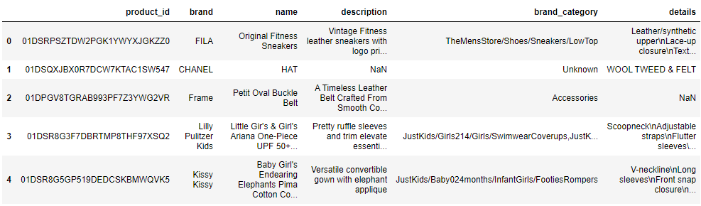
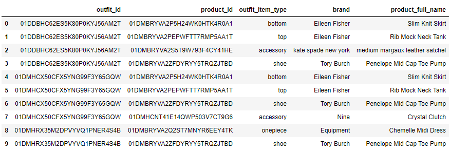
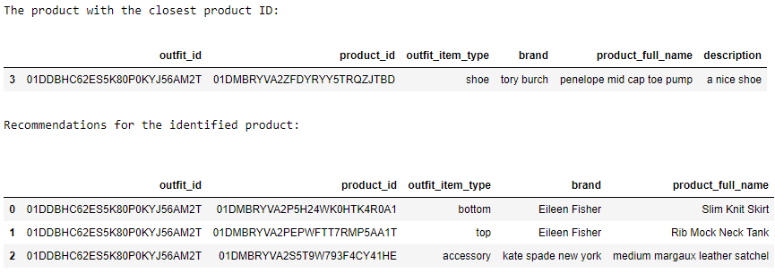
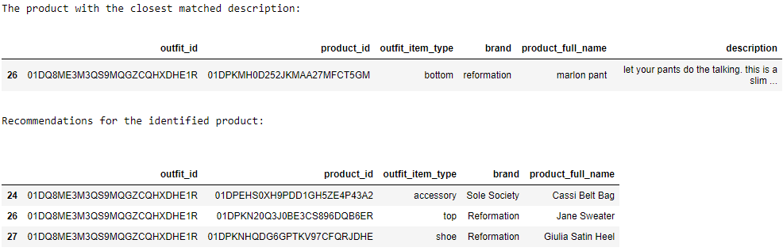

# NLP_Recommendation_Threadtogether
The goal of this project is to build a recommendation system that matches user input text to appropriate outfit combinations for Thread Together, an organization for clothing donations. 

**Dataset**
- Scraped web data: a fashion item dataset with the product descriptions and details extracted from various retail websites

- Outfit combination list: outfit combinations curated by the subject matter expert stylist

The users will specify an outfit type for the search (e.g. bottom, top, accessory, shoe, one-piece) and the inputs can be either product ID or free-form text such as brand and description.

## Summary
- If the user input is product ID, I find the corresponding product.
- If the user input is product Id but misspelled, I find the closest product using fuzzy matching.
- Otherwise, I use word embeddings and cosine similarity to find the product with the closest match with the input text.
- Then, I return all outfit combinations belonging to the same outfit ID as the identified product.

## Conclusion (Examples)
- If the user is looking for shoes with the product ID '01DMBRYVA2ZFDYRYY5TRQZJTBD,' the algorithm will return the following recommendation:

- If the user is looking for bottoms like 'slim fitting, straight leg pant with a center back zipper and slightly cropped leg,' the algorithm will return the following recommendation: 

